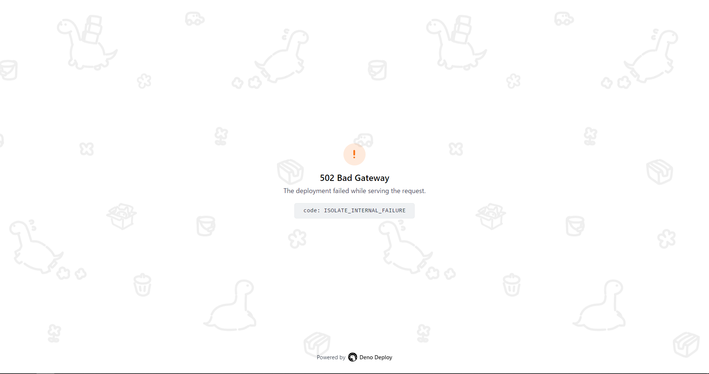

# Verify Deno Deploy 502

## 本リポジトリの目的
非公開リポジトリで発生したDeno Deployの502エラーの原因を特定したい

## 本リポジトリの達成目標
エラー原因を特定し、引き続き開発できるようにする

### 確認用タスク
- [x] コア機能と詳細ページとサンプルデータを削除
- [x] 詳細ページを復活
- [x] サンプルデータを復活
- [x] データの読み出し機能復活
- [ ] Markdown変換

## 参考資料
- [fresh-blog/posts.ts at main · littlesticks/fresh-blog · GitHub](https://github.com/littlesticks/fresh-blog/blob/main/utils/posts.ts#L13)
